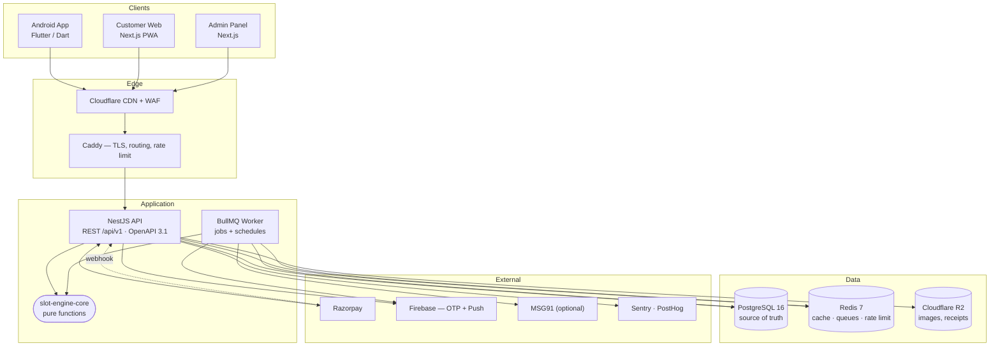
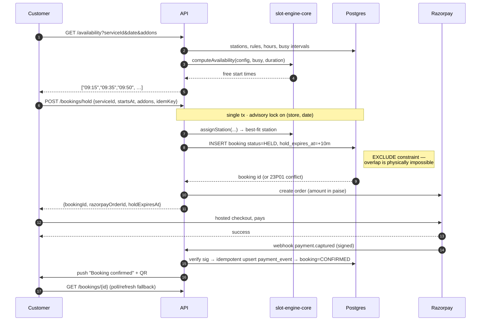
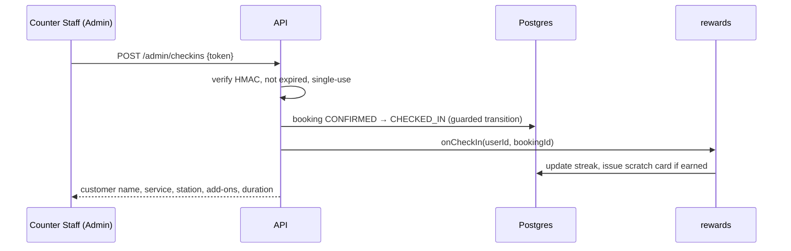

# 03 — Technical Architecture

## 1. Architectural style

**A modular monolith with hard internal boundaries, not microservices.**

One outlet doing a few hundred bookings a day does not need a distributed system; it needs
correctness and speed of delivery. But the modules are separated as if they *were* services —
each owns its tables, exposes a typed service interface, and never reaches into another
module's tables directly. When one of them genuinely needs to scale independently, it lifts
out without a rewrite.

The only piece that must be perfect from day one is the **Slot & Station Engine**. It is
isolated as a pure, side-effect-free package (`packages/slot-engine-core`) so it can be
tested exhaustively without a database, and reused identically by the API, the admin
preview, and the seed/simulation tooling.

---

## 2. System diagram

---

## 3. Backend modules

Each module = one NestJS module, one folder, its own tables, a public service interface.

| Module | Owns | Key responsibility |
|---|---|---|
| `auth` | `users`, `otp_attempts`, `sessions`, `admin_users`, `roles` | Phone OTP, JWT issue/refresh, RBAC guards |
| `catalog` | `segments`, `categories`, `services`, `addon_groups`, `addon_options` | The dynamic menu; heavily cached |
| `capacity` | `stations`, `station_services`, `allocation_rules`, `store_hours`, `blackouts`, `store_settings` | Everything that defines what capacity exists and when |
| `availability` | *(no tables — reads `capacity` + `booking`)* | Computes free slots. Wraps `slot-engine-core`. |
| `booking` | `bookings`, `booking_items`, `booking_addons`, `booking_status_history` | Hold → confirm → check-in → complete lifecycle; station assignment |
| `payment` | `payments`, `refunds`, `payment_events` | Razorpay orders, signature verification, idempotent webhooks, reconciliation |
| `checkin` | *(writes `bookings`)*, `checkin_tokens` | QR issue and single-use redemption |
| `rewards` | `streak_rules`, `user_streaks`, `scratch_campaigns`, `scratch_rewards`, `scratch_cards`, `user_rewards` | Streak accrual, card issue/scratch, reward ledger and redemption |
| `catalogue-shop` | `products`, `product_orders`, `product_order_items` | Storefront (P2), pickup-at-store only |
| `notification` | `notification_log`, `device_tokens` | Push/SMS dispatch, templates, quiet hours |
| `reporting` | *(read-only views)* | Revenue, utilisation, no-show, cohorts |
| `media` | `media_assets` | Upload, variant generation, CDN URLs |
| `audit` | `audit_log` | Every admin mutation, attributable to a user |
| `store` | `stores` | Multi-outlet root. Every table above carries `store_id`. |

**Boundary rule:** a module may import another module's *service*, never its *repository* or
Prisma models. Enforced by an ESLint import-boundary rule in CI, so it doesn't erode.

---

## 4. Key request flows

### 4.1 Booking with payment — the critical path

**Failure handling, explicitly:**

- **Conflict on insert** (`23P01`) → the slot went in the last few hundred ms. Return `409` with a freshly computed slot list so the UI re-renders without a manual retry.
- **Customer abandons checkout** → hold expires; `expire-holds` job (every 30 s) releases it; slot returns to the pool.
- **Payment captured but our webhook never arrived** → the reconciliation job polls Razorpay for `HELD` bookings older than the hold window and confirms or refunds. Money is never left in limbo.
- **Payment succeeded after the hold expired and the slot was retaken** → auto-refund is initiated and the customer is notified with alternative slots. Rare, but it *will* happen, so it is designed for rather than discovered.
- **Duplicate submit** → `Idempotency-Key` header; the same key returns the same booking.

### 4.2 QR check-in

The QR payload is `RST1.<booking_public_id>.<hmac>` — signed, so a forged code fails
verification, and the status transition is guarded, so a replayed code fails on the second
scan.

---

## 5. Cross-cutting concerns

| Concern | Approach |
|---|---|
| **Auth** | Customer: Firebase phone OTP → our own JWT (15 min access / 30 day rotating refresh). Admin: email + password (argon2id) + optional TOTP, 8-hour sessions. |
| **Authorisation** | Role guard + resource guard. Counter Staff can check in and create walk-ins; only Owner/Manager can touch pricing or capacity. |
| **Validation** | Zod schemas in `packages/types` — the same schema validates the request on the server and the form on the client. |
| **Idempotency** | `Idempotency-Key` required on all POSTs that create money or capacity. Stored 24 h with the response. |
| **Rate limiting** | OTP: 3/phone/hour, 10/IP/hour. Booking hold: 10/user/hour. Global: 100 req/min/IP. |
| **Caching** | Catalog cached in Redis, invalidated on admin write. Availability is **never** cached beyond 5 s — stale slots are worse than a slow query. |
| **Time** | Store `timestamptz` (UTC). Slot arithmetic in store-local wall time. Store timezone is a per-store column. |
| **Money** | Integer paise, always. Every amount is decomposed into `base + addons − discount = payable` and stored, so any receipt can be reconstructed. |
| **Media** | Upload → API validates type/size → R2 → sharp generates 3 variants → CDN URL stored. |
| **Audit** | Every admin mutation writes `audit_log` (actor, entity, before, after, IP). |
| **Errors** | RFC 9457 problem+json with a stable `code` string. Clients switch on `code`, never on message text. |
| **Config** | Env vars validated by Zod at boot; the process refuses to start on a bad config rather than failing at 2 a.m. |
| **Backups** | Nightly `pg_dump` → R2, 30-day retention, plus a documented restore drill run before launch and quarterly after. |

---

## 6. Scaling plan

The design targets **20 outlets · 20k MAU · 2,000 bookings/day** with no re-architecture.

| Stage | Trigger | Action |
|---|---|---|
| **1 — Launch** | 1 outlet | Single VPS, Docker Compose, one API process. |
| **2 — Traction** | p95 latency drift, or >2 outlets | Managed Postgres with PITR; move `web`/`admin` to an edge host; 2–3 stateless API replicas. |
| **3 — Multi-outlet** | 5+ outlets | Read replica for reporting; per-store cache partitioning; per-store Redis queue lanes so one busy outlet can't starve another. |
| **4 — Scale-out** | Sustained load or a heavy module | Extract `reporting`, then `notification`, then `rewards` into separate deployables — the module boundaries already exist. `booking` + `availability` + `capacity` stay together permanently; they share a transactional invariant and must never be split. |

**Design choices made now that buy this later, at near-zero cost today:**

1. `store_id` on every table, and in every index prefix.
2. The availability engine is a pure function over `(config, busyIntervals, request)` — no DB access inside. It can move to a cache, an edge worker, or a separate service unchanged.
3. All writes go through service interfaces, so a repository can later become an RPC call.
4. Jobs are queued, not run inline, so the worker scales independently of the API.
5. The correctness invariant lives in Postgres, not in application code, so adding API replicas can never introduce a double-booking.

### 6.1 What deliberately does *not* scale, and why that's fine

Availability is computed live on every request rather than from a materialised slot table.
For one outlet with ~10 stations and ~50 bookings a day, that's a single indexed range query
over a few dozen rows plus in-memory interval math — sub-10 ms. Materialising slots would add
a whole invalidation surface (every booking, cancellation, rule change and blackout would
have to fan out) to buy performance nobody needs yet. If a single outlet ever exceeds ~500
bookings/day, a per-(store, date) precomputed availability cache with event-driven
invalidation drops in behind the same interface.

---

## 7. Security

- TLS everywhere; HSTS; secure cookie flags on admin sessions.
- No card data on our infrastructure — Razorpay hosted checkout only.
- Webhook signature verification with replay protection (`event_id` unique + timestamp window).
- Argon2id for admin passwords; OTP codes stored hashed with short TTL and attempt caps.
- SQL injection prevented by parameterised queries; the few raw SQL statements are reviewed and parameterised.
- Admin panel is `noindex`, on a separate subdomain, with optional IP allowlisting for owner-level routes.
- PII minimised: phone, name, gender. No health data, no ID documents.
- DPDP Act 2023: consent captured at signup, in-app account deletion (soft-delete with 30-day purge), data export on request.
- Dependency scanning (`pnpm audit` + Dependabot) in CI.

---

## 8. Observability

| Signal | Tool | What we actually watch |
|---|---|---|
| Errors | Sentry | Booking-flow exceptions, webhook failures |
| Logs | pino → JSON, request-id correlated | Every booking state transition |
| Uptime | BetterStack | `GET /health` and a synthetic availability query |
| Product analytics | PostHog | Funnel: service view → slot pick → pay → check-in |
| Business alerts | Slack/email webhook | Payment captured with no confirmed booking · hold-expiry backlog · a station idle >2 h in store hours |

That last row is the one worth building: **a payment with no matching confirmed booking is a
customer with money taken and nothing to show for it**, and it needs to page a human within
minutes, not surface in a weekly report.
