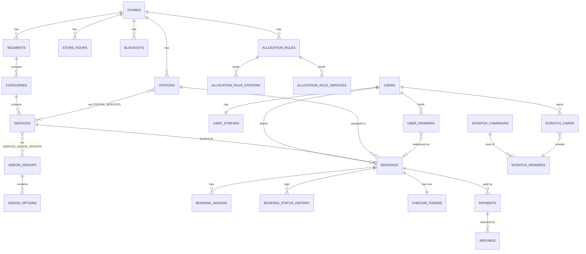

# 04 — Data Model

PostgreSQL 16. All tables use `uuid` primary keys (`gen_random_uuid()`), `created_at` /
`updated_at` `timestamptz`, and — except for `stores` itself — a `store_id` FK.

**Conventions**

| Rule | Detail |
|---|---|
| Money | `integer` **paise**. `price_paise`, never `price`. No floats in the money path. |
| Time | `timestamptz` (UTC) for instants. `time` + a store timezone for recurring wall-clock config. |
| Durations | `integer` minutes. |
| Soft delete | `deleted_at timestamptz NULL` on catalog and user tables. Bookings and payments are never deleted. |
| Enums | Postgres native enums. |
| Multi-outlet | Every index that matters is prefixed with `store_id`. |

---

## 1. ERD (core)



---

## 2. Store & capacity

### `stores`
| Column | Type | Notes |
|---|---|---|
| `id` | uuid PK | |
| `name` | text | "RESET — Satellite" |
| `slug` | text UNIQUE | |
| `timezone` | text | `Asia/Kolkata` |
| `address`, `city`, `pincode`, `phone` | text | |
| `lat`, `lng` | numeric | Map link |
| `is_active` | bool | |

### `store_settings` (1:1 with store)
| Column | Type | Notes |
|---|---|---|
| `store_id` | uuid PK FK | |
| `buffer_minutes` | int | Default 5 — cleaning / station reset |
| `slot_granularity_minutes` | int | Default 5 — the grid slot start times snap to |
| `booking_horizon_days` | int | Default 7 — how far ahead customers may book |
| `min_lead_minutes` | int | Default **0** — earliest a booking may start relative to now. `0` reproduces the proposal's worked example exactly (9:05 → 9:15); raise it if the counter needs prep warning. |
| `hold_ttl_minutes` | int | Default 10 — payment soft-lock window |
| `cancellation_window_minutes` | int | Default 120 |
| `currency` | text | `INR` |

### `stations`
> Internal name for a bed/table. Never rendered to customers.

| Column | Type | Notes |
|---|---|---|
| `id` | uuid PK | |
| `store_id` | uuid FK | |
| `name` | text | "Station 1" |
| `is_active` | bool | Inactive = never assignable |
| `sort_order` | int | Tie-breaker in assignment |
| `allows_all_services` | bool | `true` (default) → every service. `false` → restricted to `station_services`. |

### `station_services` — station→service designation
> Client req 02/08: *"certain beds may be designated only for head massage based on space constraints"*

| Column | Type |
|---|---|
| `station_id` | uuid FK |
| `service_id` | uuid FK |

PK `(station_id, service_id)`. Only consulted when `allows_all_services = false`.

### `store_hours`
| Column | Type | Notes |
|---|---|---|
| `store_id` | uuid FK | |
| `day_of_week` | smallint | 0=Sun … 6=Sat |
| `opens_at` / `closes_at` | time | Local wall time |
| `is_closed` | bool | Weekly off |

Multiple rows per day are allowed, which supports a lunch-break split (e.g. 09:00–13:00 and 16:00–21:00).

### `blackouts` — holidays and ad-hoc blocked windows
| Column | Type | Notes |
|---|---|---|
| `id` | uuid PK | |
| `store_id` | uuid FK | |
| `station_id` | uuid FK NULL | `NULL` = whole store; set = one station (e.g. maintenance) |
| `starts_at` / `ends_at` | timestamptz | |
| `reason` | text | Shown in admin only |

### `allocation_rules` — time-boxed station reservation
> Client req 02/08: *"in the morning, I can push for ₹199 service. The system should allow me to allocate only a predefined number of beds exclusively for that service during that time. Those reserved beds should not be available for any other service until the allocated time slot ends."*

| Column | Type | Notes |
|---|---|---|
| `id` | uuid PK | |
| `store_id` | uuid FK | |
| `name` | text | "Morning ₹199 push" |
| `mode` | enum | `EXCLUSIVE_TO` — listed stations serve **only** the listed services in the window · `EXCLUDE_FROM` — listed stations may **not** serve the listed services |
| `recurrence` | enum | `ONE_OFF` \| `WEEKLY` |
| `days_of_week` | smallint[] | For `WEEKLY` |
| `date_from` / `date_to` | date NULL | Optional validity range |
| `starts_at_local` / `ends_at_local` | time | Wall-clock window |
| `priority` | int | Higher wins on conflict |
| `is_active` | bool | |

`allocation_rule_stations (rule_id, station_id)` · `allocation_rule_services (rule_id, service_id)`

**Why explicit station IDs rather than just a count.** "Reserve 2 beds" is ambiguous —
*which* two changes the answer for every other service, and a count that's resolved
differently on each availability query produces slot lists that flicker between page loads.
The admin UI presents it as "reserve N stations" and lets the manager pick which, or
auto-picks the lowest-`sort_order` eligible stations and **persists that choice**. The
customer-facing behaviour is then deterministic and reproducible, which also makes it
debuggable when the owner says "why didn't 10:15 show up".

---

## 3. Catalog

### `segments`
`id` · `store_id` · `name` ("Men") · `slug` · `image_url` · `sort_order` · `is_active` · `deleted_at`

### `categories`
`id` · `store_id` · `segment_id` · `name` ("Stress Relief") · `slug` · `description` · `image_url` · `sort_order` · `is_active` · `deleted_at`

### `services`
| Column | Type | Notes |
|---|---|---|
| `id` | uuid PK | |
| `store_id`, `category_id` | uuid FK | |
| `name` | text | "Head + Neck + Shoulder" |
| `slug` | text | Unique per store |
| `description` | text | |
| `image_url` | text | |
| `price_paise` | int | 9900 = ₹99 |
| `duration_minutes` | int | **Required, > 0** — the engine cannot function without it |
| `buffer_override_minutes` | int NULL | Falls back to `store_settings.buffer_minutes` |
| `max_per_slot` | int NULL | Optional cap independent of station count |
| `is_active` | bool | Disable without deleting |
| `sort_order` | int | |
| `deleted_at` | timestamptz NULL | |

### `addon_groups`
| Column | Type | Notes |
|---|---|---|
| `id` | uuid PK | |
| `store_id` | uuid FK | |
| `name` | text | "Oil Choice" |
| `min_select` / `max_select` | int | Oil Choice = `0` / `1` |
| `sort_order` | int | |

### `service_addon_groups`
`(service_id, addon_group_id, sort_order)` — many-to-many, because the menu attaches the
same Oil Choice group to all three Stress Relief services ("same").

### `addon_options`
| Column | Type | Notes |
|---|---|---|
| `id` | uuid PK | |
| `addon_group_id` | uuid FK | |
| `name` | text | "Almond" |
| `price_delta_paise` | int | 3000 = +₹30 |
| `duration_delta_minutes` | int | Default 0 — fed into the engine when non-zero |
| `is_active`, `sort_order` | | |

---

## 4. Users & bookings

### `users`
`id` · `phone` (E.164, UNIQUE) · `name` · `gender` · `email` NULL · `date_of_birth` NULL ·
`preferred_segment_id` NULL · `is_blocked` · `blocked_reason` · `last_login_at` ·
`deleted_at` · `consent_at`

### `admin_users`
`id` · `store_id` NULL (NULL = all stores, owner) · `email` UNIQUE · `password_hash` (argon2id) ·
`name` · `role` enum `OWNER|MANAGER|STAFF` · `totp_secret` NULL · `is_active` · `last_login_at`

### `bookings` — the centre of the system

| Column | Type | Notes |
|---|---|---|
| `id` | uuid PK | |
| `public_id` | text UNIQUE | `RST-2K8F4M` — short, human-readable, used at the counter |
| `store_id` | uuid FK | |
| `user_id` | uuid FK NULL | NULL for staff-created walk-ins with no account |
| `service_id` | uuid FK | |
| `station_id` | uuid FK | Assigned by the engine at hold time |
| `status` | enum | `HELD · CONFIRMED · CHECKED_IN · IN_PROGRESS · COMPLETED · CANCELLED · NO_SHOW · EXPIRED` |
| `source` | enum | `APP · WEB · ADMIN_WALKIN` |
| `starts_at` | timestamptz | |
| `ends_at` | timestamptz | `starts_at + total_duration_minutes` |
| `blocked_until` | timestamptz | `ends_at + buffer` — **this is what the overlap constraint uses** |
| `total_duration_minutes` | int | Service + add-on deltas, snapshotted |
| `hold_expires_at` | timestamptz NULL | Set while `HELD` |
| `service_name_snapshot` | text | Prices and names change; receipts must not |
| `base_price_paise` | int | |
| `addons_price_paise` | int | |
| `discount_paise` | int | |
| `payable_paise` | int | `base + addons − discount` |
| `applied_reward_id` | uuid FK NULL | |
| `idempotency_key` | text NULL | |
| `cancelled_at`, `cancel_reason`, `checked_in_at`, `completed_at` | | |
| `notes` | text | Staff notes |

**The constraint that makes the whole product trustworthy:**

```sql
CREATE EXTENSION IF NOT EXISTS btree_gist;

ALTER TABLE bookings ADD CONSTRAINT bookings_no_station_overlap
EXCLUDE USING gist (
  station_id  WITH =,
  tstzrange(starts_at, blocked_until, '[)') WITH &&
) WHERE (status IN ('HELD','CONFIRMED','CHECKED_IN','IN_PROGRESS'));
```

Two overlapping bookings on one station cannot exist. Not "shouldn't" — *cannot*. Any
concurrent insert that would violate it fails with SQLSTATE `23P01`, which the API translates
to a `409 SLOT_TAKEN` plus a refreshed slot list.

**Indexes**
```sql
CREATE INDEX bookings_store_day       ON bookings (store_id, starts_at)
                                      WHERE status NOT IN ('CANCELLED','EXPIRED','NO_SHOW');
CREATE INDEX bookings_station_range   ON bookings USING gist (station_id, tstzrange(starts_at, blocked_until));
CREATE INDEX bookings_user_recent     ON bookings (user_id, starts_at DESC);
CREATE INDEX bookings_hold_expiry     ON bookings (hold_expires_at) WHERE status = 'HELD';
CREATE UNIQUE INDEX bookings_idem     ON bookings (store_id, idempotency_key) WHERE idempotency_key IS NOT NULL;
```

### `booking_addons`
`id` · `booking_id` · `addon_option_id` · `name_snapshot` · `price_delta_paise` · `duration_delta_minutes`

### `booking_status_history`
`id` · `booking_id` · `from_status` · `to_status` · `actor_type` (`CUSTOMER|ADMIN|SYSTEM`) · `actor_id` · `reason` · `created_at`

Every transition is logged. When the owner asks why a booking was cancelled at 9:04 pm, there is an answer.

---

## 5. Payments

### `payments`
`id` · `store_id` · `booking_id` NULL · `product_order_id` NULL · `gateway` (`RAZORPAY`) ·
`gateway_order_id` · `gateway_payment_id` NULL · `amount_paise` · `currency` ·
`status` enum `CREATED|AUTHORIZED|CAPTURED|FAILED|REFUNDED|PARTIALLY_REFUNDED` ·
`method` · `failure_reason` · `raw_payload` jsonb

### `refunds`
`id` · `payment_id` · `gateway_refund_id` · `amount_paise` · `status` · `reason` · `initiated_by`

### `payment_events` — webhook idempotency
`id` · `gateway` · `event_id` **UNIQUE** · `event_type` · `payload` jsonb · `processed_at` · `processing_error`

`event_id UNIQUE` is the whole idempotency mechanism: Razorpay retries webhooks, and a
duplicate insert simply fails and is treated as already-processed.

---

## 6. Check-in

### `checkin_tokens`
`id` · `booking_id` UNIQUE · `token` (32-byte base64url, UNIQUE) · `issued_at` · `used_at` NULL · `used_by_admin_id` NULL

QR payload: `RST1.<booking.public_id>.<hmac_sha256(token, server_secret)[0:16]>`

Single-use (`used_at`) plus a guarded `CONFIRMED → CHECKED_IN` transition, so a screenshotted
QR cannot be reused and a forged one fails HMAC verification.

---

## 7. Rewards

### `streak_rules`
`id` · `store_id` · `name` · `required_visits` · `within_days` (rolling window) ·
`reward_type` enum `PERCENT_OFF|FLAT_OFF|FREE_SERVICE|FREE_ADDON` · `reward_value` ·
`reward_service_id` NULL · `validity_days` · `is_active`

### `user_streaks`
`user_id` PK · `store_id` · `current_count` · `best_count` · `last_checkin_at` · `window_started_at` · `total_visits`

Streaks accrue **only on `CHECKED_IN`** (proposal §3.6), never on booking.

### `scratch_campaigns`
`id` · `store_id` · `name` · `trigger` enum `ON_CHECKIN|ON_NTH_BOOKING|ON_STREAK_COMPLETE` ·
`trigger_value` · `is_active` · `starts_at` · `ends_at`

### `scratch_rewards` — the pool
`id` · `campaign_id` · `label` ("₹50 off your next reset") · `reward_type` · `reward_value` ·
`weight` int · `stock_total` int NULL · `stock_used` int · `validity_days` · `is_active`

### `scratch_cards`
`id` · `user_id` · `campaign_id` · `booking_id` NULL · `status` enum `ISSUED|SCRATCHED|EXPIRED` ·
`scratch_reward_id` NULL · `issued_at` · `scratched_at` · `expires_at`

The winning reward is drawn **server-side at scratch time**, inside a transaction that
weight-samples from the pool and decrements `stock_used` under a row lock. The client is
never told the outcome before the animation, and stock caps can't be blown by concurrent
scratches.

### `user_rewards` — the redeemable ledger
`id` · `user_id` · `store_id` · `source` enum `SCRATCH_CARD|STREAK|PROMO|MANUAL` · `source_id` ·
`reward_type` · `reward_value` · `min_order_paise` · `valid_from` · `valid_till` ·
`status` enum `ACTIVE|REDEEMED|EXPIRED|REVOKED` · `redeemed_booking_id` NULL

Redemption does `SELECT … FOR UPDATE` on the reward row inside the booking transaction, so a
reward can never be spent twice by two parallel checkouts.

---

## 8. Products (P2)

`products` — `id` · `store_id` · `name` · `slug` · `description` · `images` jsonb · `price_paise` · `mrp_paise` · `stock_qty` · `sku` · `is_active` · `sort_order`

`product_orders` — `id` · `public_id` · `store_id` · `user_id` · `status` enum `PENDING|PAID|READY_FOR_PICKUP|PICKED_UP|CANCELLED` · `total_paise` · `payment_id`

`product_order_items` — `id` · `product_order_id` · `product_id` · `name_snapshot` · `unit_price_paise` · `qty`

Fulfilment is pickup-at-store. No delivery, addresses or logistics.

---

## 9. Platform tables

| Table | Columns |
|---|---|
| `device_tokens` | `id` · `user_id` · `token` · `platform` (`ANDROID\|WEB\|IOS`) · `last_seen_at` |
| `notification_log` | `id` · `user_id` · `channel` · `template` · `payload` jsonb · `status` · `error` · `sent_at` |
| `otp_attempts` | `id` · `phone` · `attempts` · `window_started_at` · `blocked_until` |
| `media_assets` | `id` · `store_id` · `key` · `mime` · `bytes` · `width` · `height` · `variants` jsonb |
| `audit_log` | `id` · `store_id` · `admin_user_id` · `action` · `entity_type` · `entity_id` · `before` jsonb · `after` jsonb · `ip` · `created_at` |
| `idempotency_keys` | `key` · `store_id` · `endpoint` · `request_hash` · `response` jsonb · `expires_at` |

---

## 10. Seed data

The seeder loads the MEN menu exactly as photographed — 1 segment, 3 categories, 5 priced
services + 3 Instant Glow placeholders (inactive until priced), 2 add-on groups, 5 add-on
options, 3 stations, 09:00–21:00 hours, 5-min buffer — so the first `pnpm dev` produces a
browsable, bookable store. See [doc 01 §4.3](01-product-requirements.md#43-seed-catalog--men-from-the-menu-photos).
