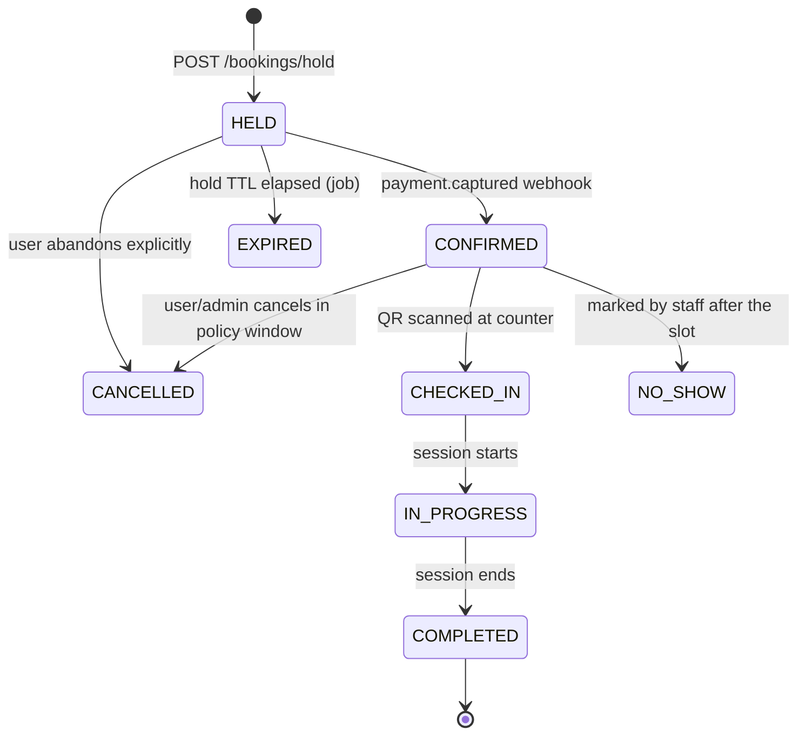

# 05 — Slot & Station Engine

> This is the heart of the system. Everything else is CRUD. Read this one properly.

The store has a fixed number of stations. Every service has a different duration. The engine
must guarantee that no two customers are ever assigned the same station at overlapping times,
while showing customers only the times that genuinely work for the *specific* service they
picked.

---

## 1. Design principles

| Principle | Consequence |
|---|---|
| **Availability is computed, never stored** | No fixed slot grid in the database. Free time is derived live from stations + bookings + rules + buffer. Nothing to invalidate, nothing to drift. |
| **Correctness lives in Postgres, not in code** | A GiST exclusion constraint makes overlap physically impossible. Application logic decides *which* station; the database decides whether it's *legal*. |
| **The engine is a pure function** | `computeAvailability(config, busy, request) → slots`. No I/O, no clock access, no DB. Fully testable, portable to cache/edge later. |
| **The customer sees a time, never a station** | Station assignment is silent and internal (proposal §4.3). |
| **Deterministic** | Same inputs → same output, every time. Slot lists that flicker between refreshes destroy trust and are undebuggable. |

---

## 2. Inputs

```ts
type AvailabilityInput = {
  now: Instant
  date: LocalDate
  timezone: string                       // 'Asia/Kolkata'

  service: { id: string; durationMinutes: number; bufferOverrideMinutes: number | null }
  addons: { durationDeltaMinutes: number }[]

  stations: { id: string; sortOrder: number; allowsAllServices: boolean; serviceIds: string[] }[]
  openWindows: { start: Instant; end: Instant }[]     // that date's store hours, may be split
  blackouts: { stationId: string | null; start: Instant; end: Instant }[]
  busy: { stationId: string; start: Instant; blockedUntil: Instant }[]
  allocationRules: ResolvedRule[]                     // already resolved to instants for this date

  settings: {
    bufferMinutes: number
    slotGranularityMinutes: number
    minLeadMinutes: number
  }
}
```

`busy` is every booking on that date in status `HELD` (not expired), `CONFIRMED`,
`CHECKED_IN` or `IN_PROGRESS`. `blockedUntil` already includes that booking's own trailing
buffer.

---

## 3. The algorithm

### Step 0 — Derive the requested window

```
D = service.durationMinutes + Σ addons.durationDeltaMinutes     // session length
B = service.bufferOverrideMinutes ?? settings.bufferMinutes     // trailing buffer
```

A booking starting at `t` **occupies** `[t, t+D)` and **blocks** `[t, t+D+B)`.

### Step 1 — Per-station free intervals

For each active station `s`:

```
free(s) = openWindows
        − { [b.start, b.blockedUntil) : b ∈ busy where b.stationId = s }
        − { [x.start, x.end)          : x ∈ blackouts where x.stationId ∈ {s, null} }
```

Standard interval subtraction, giving a sorted list of disjoint free intervals per station.

### Step 2 — Candidate start times

```
T = sort(unique(
      ⋃ over openWindows: { w.start, w.start+G, w.start+2G, … }      // the grid
    ∪ ⋃ over stations, over free(s): { interval.start }              // exact free-from moments
))
filtered to:  t ≥ max(openWindow.start, now + minLeadMinutes)
```

**Why the union and not just the grid.** With granularity 5 and every duration a multiple of
5, free-from moments always land on the grid, so the union is redundant — today. The moment
someone creates a 12-minute service, or staff enters a walk-in at an off-grid time, a
pure-grid engine silently hides real availability. Including the exact free-from moments
costs nothing and makes the engine correct for inputs the admin panel doesn't yet forbid.

### Step 3 — Eligibility of a station for this service at this time

`stationAllows(s, service, [t, t+D))` is true when **all** of:

1. **Static designation** — `s.allowsAllServices` OR `service.id ∈ s.serviceIds`
   *(client req: certain stations are designated for specific services only)*

2. **Allocation rules** — take the rules that both include `s` and overlap `[t, t+D)`, sorted
   by `priority` descending. The first applicable rule decides:

   | Rule mode | Service in rule's list? | Verdict |
   |---|---|---|
   | `EXCLUSIVE_TO` | yes | **Allow** — this is exactly what the station was reserved for |
   | `EXCLUSIVE_TO` | no | **Deny** — station is reserved for other services in this window |
   | `EXCLUDE_FROM` | yes | **Deny** |
   | `EXCLUDE_FROM` | no | **Allow** |

   No applicable rule → allow.

   A rule counts as applying if it overlaps `[t, t+D)` **at all**, even partially. A 30-minute
   Full Body that spills 5 minutes into a window reserved for the ₹199 push would otherwise
   quietly eat the reserved capacity, which is precisely what the reservation exists to
   prevent.

### Step 4 — Does the service fit?

For candidate `t` and station `s`, `t` is bookable on `s` when:

| Check | Rule |
|---|---|
| Session inside store hours | `∃ w ∈ openWindows : [t, t+D) ⊆ w` |
| No overlap with anything busy | `[t, t+D+B)` overlaps no busy interval on `s` |
| No blackout on the session | `[t, t+D)` overlaps no blackout for `s` |
| Station eligible | `stationAllows(s, service, [t, t+D))` |

Two deliberate asymmetries:

- **The session must fit inside store hours; the trailing buffer may run past closing.** The buffer is cleaning time — staff can reset a station after the shutters come down. Otherwise the last bookable slot of every day is needlessly thrown away.
- **The buffer is checked against bookings but not against blackouts.** A maintenance window starting the moment a session ends is fine; the cleaning happens during the maintenance.

The buffer check is symmetric across bookings and needs no special casing: the new booking
carries its own trailing buffer, and every existing booking's `blockedUntil` already carries
its own. Placed before or after, the gap is always respected.

### Step 5 — Result

```ts
type Slot = { startsAt: Instant; endsAt: Instant; stationsAvailable: number }
```

Return every `t` with at least one bookable station, plus the count — which drives the
"only 1 left at this time" urgency cue in the UI.

### Step 6 — Station assignment (only at booking time)

The customer picked a time; the engine now picks the station. Among stations bookable at `t`,
rank by:

1. **Purpose first** — a station reserved `EXCLUSIVE_TO` this service in this window wins. Reserved capacity should be consumed by the service it was reserved for, before it spills onto general stations.
2. **Tightest fit** — let `[gs, ge)` be the free interval containing `[t, t+D+B)`. Score = `(t − gs) + (ge − (t+D+B))`. Lowest wins. This is best-fit packing: it fills small gaps first and preserves long contiguous blocks for the 30-minute services that need them.
3. **Most specialised first** — fewer `serviceIds` wins. A station that can only host Head Massage should take the Head Massage, keeping the general stations free.
4. **Lowest `sortOrder`** — final tie-break, purely for determinism.

Without rule 2, a stream of 10-minute bookings scattered across empty stations leaves the
whole day fragmented into 10-minute holes and no ₹299 Premium can ever be booked. Best-fit
packing is what keeps the high-value services sellable.

---

## 4. Worked example A — the proposal's scenario

3 stations · 5-min buffer · everything booked at 9:00 AM · granularity 5 min · min lead 0.

| Station | Service | Duration | Session ends | Blocked until | Free from |
|---|---|---|---|---|---|
| Station 1 | Head Massage | 10 min | 9:10 | 9:15 | **9:15** |
| Station 2 | Full Body | 30 min | 9:30 | 9:35 | **9:35** |
| Station 3 | Full Body | 30 min | 9:30 | 9:35 | **9:35** |

**Customer opens the app at 9:05 and picks Head Massage (10 min):**

- `D = 10`, `B = 5` → needs a 15-minute clear block.
- Candidates ≥ 9:05: 9:05, 9:10, 9:15, 9:20 …
- 9:05 → every station busy. ✗
- 9:10 → still inside Station 1's buffer (blocked until 9:15). ✗
- **9:15 → Station 1 free, `[9:15, 9:30)` clear. ✓**

**Result: earliest slot 9:15 AM** — matches the proposal exactly.

**Same moment, but the customer picks Full Body (30 min):**

- `D = 30`, `B = 5` → needs a 35-minute clear block.
- 9:15 → Station 1 is free from 9:15, and nothing follows it → `[9:15, 9:50)` is clear. ✓

So Full Body *is* offered at 9:15 here, because Station 1 has an open-ended gap. The
duration-awareness bites when there's a booking behind the gap:

**Variant — Station 1 also has a booking at 9:40:**

- Station 1's free interval is `[9:15, 9:40)` = 25 minutes.
- Head Massage needs 15 → fits. ✓ Offered at 9:15.
- Full Body needs 35 → doesn't fit. ✗ Not offered at 9:15; next Full Body slot is 9:35 on Station 2 or 3.

That is the proposal's guarantee verbatim: *"A 30-min Full Body will not be offered in a 20-min gap, even though a 10-min Head Massage would be."*

---

## 5. Worked example B — the morning ₹199 push

> Client req 02/08: *"in the morning, I can push for ₹199 service. The system should allow me to allocate only a predefined number of beds exclusively for that service during that time."*

**Setup:** 3 stations. Rule *"Morning ₹199 push"* — `EXCLUSIVE_TO`, weekly Mon–Sat,
09:00–12:00, stations `[Station 2, Station 3]`, services `[Full Body Relax → Basic ₹199]`.

At 10:00, all three stations are physically free.

| Customer picks | Station 1 | Station 2 | Station 3 | Slot shown? |
|---|---|---|---|---|
| Basic (₹199, 20 min) | ✓ allowed (no rule) | ✓ allowed (exclusive, matching service) | ✓ allowed | Yes — 3 stations available |
| Head Massage (₹49, 10 min) | ✓ allowed | ✗ reserved for Basic | ✗ reserved for Basic | Yes — but only 1 station |
| Premium (₹299, 30 min) | ✓ allowed | ✗ reserved | ✗ reserved | Yes — 1 station |

Once Station 1 is taken at 10:00, Head Massage and Premium show **no slot at 10:00** while
Basic still shows two. Exactly the intended commercial behaviour: morning capacity is
protected for the ₹199 push.

**Assignment ordering matters here.** A Basic booking at 10:00 goes to Station 2 or 3 first
(rule 1 — purpose), never Station 1 — so the one unreserved station stays available for the
services that have nowhere else to go.

**Spillover:** at 11:50 a Basic (20 min, ends 12:10) still lands on a reserved station,
because the rule applies to any interval that *overlaps* the window. A Head Massage at 11:55
on a reserved station is refused for the same reason.

---

## 6. Worked example C — station designation

> Client req 02/08: *"certain beds may be designated only for head massage based on space constraints"*

Station 3 is a chair in a corner: `allowsAllServices = false`, `serviceIds = [Head Massage,
Head+Neck+Shoulder]`.

- Full Body Basic never sees Station 3 — it isn't physically possible there.
- Head Massage sees all three, and by assignment rule 3 (most specialised first) is placed on Station 3, keeping Stations 1 and 2 open for Full Body.

This is why rule 3 exists: without it, a ₹49 Head Massage would be dropped on the full-size
station and block a ₹299 Premium.

---

## 7. Concurrency & the hold lifecycle



`HELD`, `CONFIRMED`, `CHECKED_IN` and `IN_PROGRESS` all occupy the station. `EXPIRED`,
`CANCELLED`, `NO_SHOW` and `COMPLETED` release it.

### The hold transaction

```sql
BEGIN;

-- 1. Serialise concurrent booking attempts on the same store+day.
--    Cheap, and it turns a lock-contention storm into an orderly queue.
SELECT pg_advisory_xact_lock(hashtext('slot:' || :store_id || ':' || :local_date));

-- 2. Sweep stale holds inside the transaction. The exclusion constraint counts
--    HELD rows, so an unswept expired hold would block a perfectly free slot.
UPDATE bookings SET status = 'EXPIRED'
WHERE store_id = :store_id AND status = 'HELD' AND hold_expires_at < now();

-- 3. Recompute availability from the just-cleaned state, pick the station.

-- 4. Insert. The exclusion constraint is the real guarantee; steps 1–3 only
--    reduce how often we hit it.
INSERT INTO bookings (...) VALUES (...);
-- SQLSTATE 23P01 → 409 SLOT_TAKEN + a freshly computed slot list

COMMIT;
```

**Three layers of defence, each doing a different job:**

| Layer | Purpose |
|---|---|
| Advisory lock | Performance — avoids a thundering herd of doomed retries on a popular slot |
| Fresh recompute inside the lock | Accuracy — the availability the customer saw may be seconds stale |
| **Exclusion constraint** | Correctness — the only layer that actually *guarantees* anything, and the only one that survives a future refactor, a second API replica, or a bug in steps 1–3 |

If the constraint fires, the API returns `409 SLOT_TAKEN` with the recomputed slot list, and
the client re-renders in place. The proposal's promise — *"only one succeeds, the other is
informed instantly"* — is met by construction.

### Expiry job

`expire-holds` runs every 30 s: `HELD` rows past `hold_expires_at` → `EXPIRED`. Availability
queries additionally filter expired holds out of `busy`, so a slot frees up the instant the
TTL passes even if the job hasn't run yet.

---

## 8. Edge cases and how each is handled

| Case | Handling |
|---|---|
| Store closes at 21:00, service is 20 min | Last slot 20:40 (session ends 21:00). Buffer may run past close. |
| Split hours (13:00–16:00 lunch break) | Multiple `openWindows` per day; a session may not straddle the break. |
| Booking crosses midnight | Rejected. Store hours are assumed to be within one calendar day; validated in admin. |
| DST | India has none. Slot math still runs in store-local wall time via a tz library, so a future non-IST outlet works. |
| Service duration changed after a booking exists | Existing bookings keep their snapshotted duration. Only new bookings use the new value. |
| Station deactivated with live bookings | Admin panel blocks it and lists the affected bookings for manual reassignment. |
| Blackout created over live bookings | Same — warn, list conflicts, require explicit confirm-and-notify. |
| Add-on adds duration | Included in `D` before availability is computed, so slot lists change as the customer toggles add-ons. |
| Walk-in entered by staff | Same hold→confirm path with `source = ADMIN_WALKIN`, so the engine's picture never drifts from reality. **This is the single most important operational requirement** — see [Q4](10-open-questions.md#q4). |
| Customer books past `booking_horizon_days` | Rejected server-side; the date picker doesn't offer it. |
| Two add-ons from the same group when `max_select = 1` | Rejected by the Zod schema before pricing. |
| Clock skew between API replicas | All time comes from Postgres `now()` inside the transaction, never from the app server. |
| Reward applied to two bookings simultaneously | `SELECT … FOR UPDATE` on `user_rewards` inside the booking transaction. |

---

## 9. Performance

For one outlet on one date: ~10 stations × ~60 bookings, interval math over a few hundred
objects. Measured target **< 10 ms** engine time, **< 300 ms** p95 end-to-end for a 14-day
window (14 parallel single-date computations over one batched query).

Complexity: `O(S·log S + |T|·S)` where `S` = bookings per station, `|T|` = candidate times
(~144 for a 12-hour day at 5-min granularity). Trivially fast at this scale.

**Not cached.** A stale slot list means a customer picks a time that's already gone and hits
a 409 at the worst possible moment — during payment. Availability is recomputed every time;
the catalog around it is cached aggressively instead.

---

## 10. Test plan — the non-negotiable part

`packages/slot-engine-core` ships with:

1. **The proposal's worked example** as an executable test, asserting 9:15 exactly (§4).
2. **Duration-awareness**: a 20-min gap offers Head Massage and refuses Full Body (§4 variant).
3. **Allocation rules**: the ₹199 morning push, including the 11:50 spillover case (§5).
4. **Station designation**: Full Body never sees the corner chair (§6).
5. **Buffer**: no back-to-back booking without the configured gap, in both directions.
6. **Store hours**: session must fit; buffer may overrun closing.
7. **Split hours**: no session straddles the lunch break.
8. **Property-based (fast-check), thousands of random schedules**, asserting the invariants that must hold for *any* input:
   - No two returned assignments ever overlap on a station.
   - Every returned slot, when actually booked, inserts without violating the exclusion constraint.
   - Booking every slot the engine returns, in any order, never produces a conflict.
   - The engine never returns a slot on a station the rules forbid.
9. **Concurrency integration test**: 50 parallel holds on the last remaining slot against a real Postgres → exactly 1 success, 49 clean `409`s, zero overlapping rows.

Test 9 is the one that proves the product's core promise. It runs in CI on every commit.
